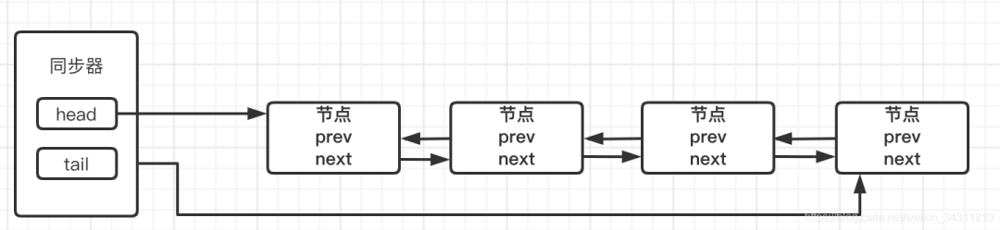
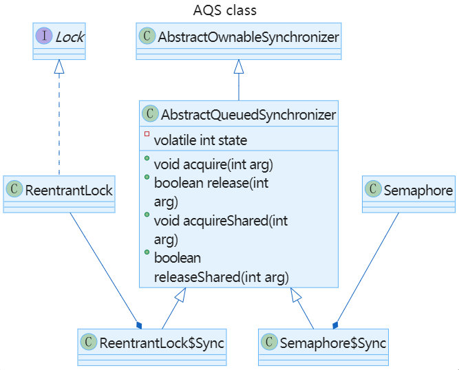

# AQS

AQS是队列同步器AbstractQueueSynchronizer的简写，它是用来构建锁和其他同步组件的基础框架，它定义了一个全局的int 型的state变量，通过内置的FIFO（先进先出）队列来完成资源竞争排队的工作。

# AQS常见方法

| 方法名称        | 方法说明                                                     |
| :-------------- | :----------------------------------------------------------- |
| acquire()       | 独占锁获取同步状态，如果当前线程获取同步状态成功，则由该方法返回，否则，将会进入同步队列等待，该方法将会调用重写的tryAccquire()方法 |
| acquireShared() | 获取共享锁，如果当前线程没有获取到共享锁，则会进入到同步等待队列，，他与独占锁不同的是，共享锁能被多个线程同时占有 |
| release         | 释放同步状态，并且通知同步器，唤醒等待队列中第一个节点中包含的线程。 |
| releaseShare    | 释放同步状态                                                 |

# AQS中同步队列的数据结构



- 当前线程获取同步状态失败，同步器将当前线程机等待状态等信息构造成一个Node节点加入队列，放在队尾，同步器重新设置尾节点
- 加入队列后，会阻塞当前线程
- 同步状态被释放并且同步器重新设置首节点，同步器唤醒等待队列中第一个节点，让其再次获取同步状态

# AQS参数

#### 状态变量state

- 互斥锁: 当AQS只实现为互斥锁的时候，每次只要原子更新state的值从0变为1成功了就获取了锁，可重入是通过不断把state原子更新加1实现的。
- 互斥锁+共享锁: 当AQS需要同时实现为互斥锁+共享锁的时候，低16位存储互斥锁的状态，高16位存储共享锁的状态，主要用于实现读写锁。

#### AQS队列

AQS中维护了一个队列，获取锁失败（非tryLock()）的线程都将进入这个队列中排队，等待锁释放后唤醒下一个排队的线程（互斥锁模式下）。


# AQS需要子类实现的方法

```java
// 互斥模式下使用：尝试获取锁
protected boolean tryAcquire(int arg) {
    throw new UnsupportedOperationException();
}
// 互斥模式下使用：尝试释放锁
protected boolean tryRelease(int arg) {
    throw new UnsupportedOperationException();
}
// 共享模式下使用：尝试获取锁
protected int tryAcquireShared(int arg) {
    throw new UnsupportedOperationException();
}
// 共享模式下使用：尝试释放锁
protected boolean tryReleaseShared(int arg) {
    throw new UnsupportedOperationException();
}
// 如果当前线程独占着锁，返回true
protected boolean isHeldExclusively() {
    throw new UnsupportedOperationException();
}
```

# AQS主要方法

#### acquire()

```java
public final void acquire(int arg) {
    //尝试获得许可， arg为许可的个数。对于重入锁来说，每次请求1个。
    if (!tryAcquire(arg) &&
    // 如果tryAcquire 失败，则先使用addWaiter()将当前线程加入同步等待队列
    // 然后继续尝试获得锁
    acquireQueued(addWaiter(Node.EXCLUSIVE), arg))
    selfInterrupt();
}
```

#### acquireQueued()

该函数表示将已经在队列中的node, 尝试去获取锁否则挂起

```java
final boolean acquireQueued(Node node, int arg) {
  boolean interrupted = false;

  try {
    while(true) {
      Node p = node.predecessor();
      // 只有队列中第二个节点能尝试, 因为第一个节点已经在运行了, 请求锁已经成功
      // 队列第2给节点, 就是最早的请求者
      if (p == this.head && this.tryAcquire(arg)) {
        this.setHead(node);
        p.next = null;	// help GC
        return interrupted;//返回false表示不能被打断，意思是没有被挂起，也就是获得到了锁
      }
			// 请求失败了, 需要 block当前线程吗? 由shouldParkAfterFailedAcquire()进行判断
      // 简单理解, 对于前序节点是signal的, 都需要park, 对于已经是cancel的节点, 进行掉过删除
      // 对于初始节点和propagate节点, 则设置signal
      // shouldParkAfterFailedAcquire将前置node设置为需要被挂起，
      // 注意这里的waitStatus是针对当前节点来说的，
      // 即是前置node的ws指的是下一个节点的状态
      if (shouldParkAfterFailedAcquire(p, node)) {
        interrupted |= this.parkAndCheckInterrupt();
      }
    }
  } catch (Throwable var5) {
    this.cancelAcquire(node);
    if (interrupted) {
      selfInterrupt();
    }

    throw var5;
  }
}
```

#### parkAndCheckInterrupt()

挂起线程 park()

```java
private final boolean parkAndCheckInterrupt() {
  LockSupport.park(this);
  return Thread.interrupted();//这里返回是否被打断，在lockInterruptibly中有意义，在lock中没有意义，个人理解只是为了代码复用。
}
```


# AQS相关类父子关系

