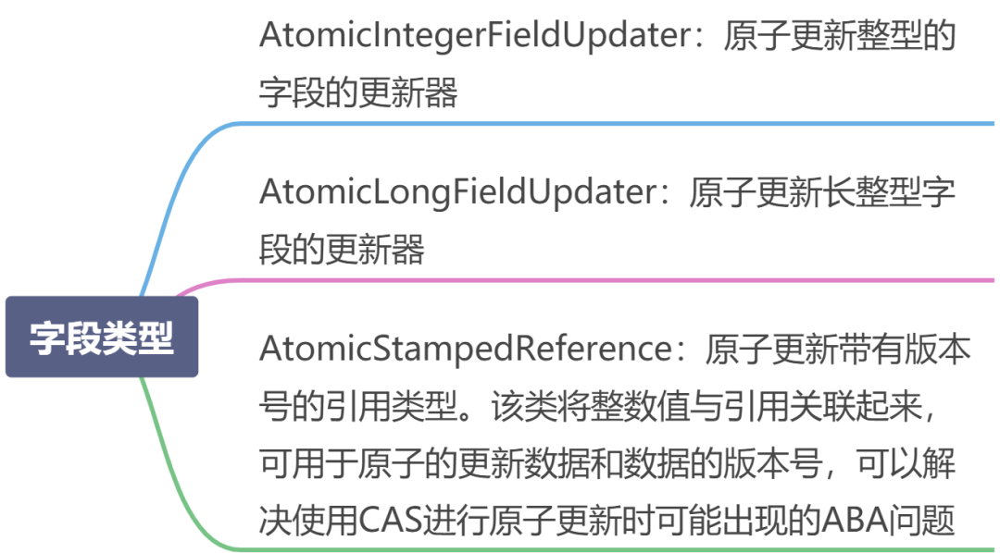
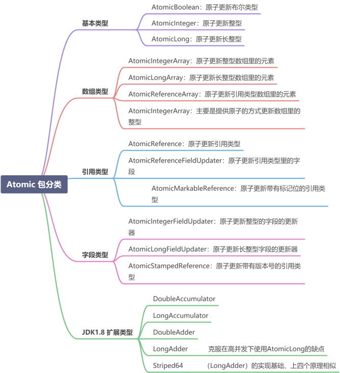

# 什么是CAS

- CAS(compare and swap) 比较并交换, cas算法, cas(v, e, n)三个参数,  v表示需要更新的变量, e表示预期值, n表示新值, 在且仅在v=e时, 才会设置成n

# CAS缺点

- ABA问题
- 自旋问题
- 范围不能灵活控制

# CAS中aba的解决方案

什么是 ABA 问题呢？多线程环境下。线程 1 从内存的V位置取出 A ，线程 2 也从内存中取出 A，并将 V 位置的数据首先修改为 B，接着又将 V 位置的数据修改为 A，线程 1 在进行`CAS`操作时会发现在内存中仍然是 A，线程 1 操作成功。尽管从线程 1 的角度来说，`CAS`操作是成功的，但在该过程中其实 V 位置的数据发生了变化，线程 1 没有感知到罢了，这在某些应用场景下可能出现过程数据不一致的问题。

- 可以版本号（version）来解决 ABA 问题的，在 `atomic` 包中提供了` AtomicStampedReference` 这个类，它是专门用来解决 ABA 问题的。
- atomic包下

# CAS 自旋导致的问题？

由于单次 `CAS` 不一定能执行成功，所以 `CAS `往往是配合着循环来实现的，有的时候甚至是死循环，不停地进行重试，直到线程竞争不激烈的时候，才能修改成功。

CPU 资源也是一直在被消耗的，这会对性能产生很大的影响。所以这就要求我们，要根据实际情况来选择是否使用 `CAS`，在高并发的场景下，通常 `CAS` 的效率是不高的。

### 什么是 AQS 吗？

`AbstractQueuedSynchronizer`抽象同步队列简称`AQS`，它是实现同步器的基础组件，并发包中锁的底层就是使用`AQS`实现的。`AQS`定义了一套多线程访问共享资源的同步框架，许多同步类的实现都依赖于它，例如常用的`Synchronized`、`ReentrantLock`、`ReentrantReadWriteLock`、`Semaphore`、`CountDownLatch`等。该框架下的锁会先尝试以`CAS`乐观锁去获取锁，如果获取不到，则会转为悲观锁（如`RetreenLock`）。

### 了解 AQS 共享资源的方式吗？

- 独占式：只有一个线程能执行，具体的Java实现有`ReentrantLock`。
- 共享式：多个线程可同时执行，具体的Java实现有`Semaphore`和`CountDownLatch`。

## Atomic 原子更新

`Java` 从 `JDK1.5` 开始提供了 `java.util.concurrent.atomic` 包，方便程序员在多线程环 境下，无锁的进行原子操作。在 `Atomic` 包里一共有 12 个类，四种原子更新方式，分别是`原子更新基本类型`，`原子更新数组`，`原子更新引用`和`原子更新字段`。在 `JDK 1.8` 之后又新增几个原子类。如下如：

# CountDownLatch

`CountDownLatch`基于线程计数器来实现并发访问控制，主要用于主线程等待其他子线程都执行完毕后执行相关操作。其使用过程为：在主线程中定义`CountDownLatch`，并将线程计数器的初始值设置为子线程的个数，多个子线程并发执行，每个子线程在执行完毕后都会调用`countDown`函数将计数器的值减1，直到线程计数器为0，表示所有的子线程任务都已执行完毕，此时在`CountDownLatch`上等待的主线程将被唤醒并继续执行。

> [突击并发编程JUC系列-并发工具 CountDownLatch](https://link.segmentfault.com/?enc=TdYA09JdP%2F3FPeCkxd7BkQ%3D%3D.6a4WoEawn9tlrAlhA5Z5NZ6i4q2qyHnduRB8iCtBdxeVu5ot%2BPRbyJL4h9uqSTe4T5q80VDZH8ShVIFQM67JCg%3D%3D)

# CyclicBarrier

`CyclicBarrier`（循环屏障）是一个同步工具，可以实现让一组线程等待至某个状态之后再全部同时执行。在所有等待线程都被释放之后，`CyclicBarrier`可以被重用。`CyclicBarrier`的运行状态叫作`Barrier`状态，在调用`await`方法后，线程就处于`Barrier`状态。

`CyclicBarrier`中最重要的方法是await方法，它有两种实现。

- `public int await()`：挂起当前线程直到所有线程都为Barrier状态再同时执行后续的任务。
- `public int await(long timeout, TimeUnit unit)`：设置一个超时时间，在超时时间过后，如果还有线程未达到`Barrier`状态，则不再等待，让达到Barrier状态的线程继续执行后续的任务。

> [突击并发编程JUC系列-并发工具 CyclicBarrier](https://link.segmentfault.com/?enc=hGvL1fJ0mgxw0erv%2BjYE8Q%3D%3D.YCKm1ArLoernWV4vk3V4wVSfcsnyYYA2%2B5TVrQDgQNDKiK%2FdX66LKexvft8rnSomrtfyiq3efYTwEl60CVEUUA%3D%3D)

# Semaphore

`Semaphore`指信号量，用于控制同时访问某些资源的线程个数，具体做法为通过调用`acquire()`获取一个许可，如果没有许可，则等待，在许可使用完毕后通过`release()`释放该许可，以便其他线程使用。

> [突击并发编程JUC系列-并发工具 Semaphore](https://link.segmentfault.com/?enc=F7vLk0BbZf5W0sc41QRz2A%3D%3D.N9bb4zZ1N8TkfeAukFco47yHa%2Btld08XeVfNzbPWzCxN4LrnoKhSSfbLLXKEvtKFnIKv8udWPWojx9%2BRIkHUtg%3D%3D)

#### CyclicBarrier 和 CountdownLatch 有什么异同？

相同点：都能阻塞一个或一组线程，直到某个预设的条件达成发生，再统一出发。
但是它们也有很多不同点，具体如下。

- 作用对象不同：`CyclicBarrier` 要等固定数量的线程都到达了栅栏位置才能继续执行，而 `CountDownLatch` 只需等待数字倒数到 0，也就是说 `CountDownLatch` 作用于事件，但 `CyclicBarrier` 作用于线程；`CountDownLatch` 是在调用了 `countDown` 方法之后把数字倒数减 1，而 `CyclicBarrier` 是在某线程开始等待后把计数减 1。
- 可重用性不同：`CountDownLatch` 在倒数到 0 并且触发门闩打开后，就不能再次使用了，除非新建一个新的实例；而 **`CyclicBarrier` 可以重复使用**。`CyclicBarrier `还可以随时调用 reset 方法进行重置，如果重置时有线程已经调用了 await 方法并开始等待，那么这些线程则会抛出 `BrokenBarrierException `异常。
- 执行动作不同：`CyclicBarrier` 有执行动作 `barrierAction`，而 `CountDownLatch `没这个功能。

# CountDownLatch、CyclicBarrier、Semaphore的区别如下。

- `CountDownLatch`和`CyclicBarrier`都用于实现多线程之间的相互等待，但二者的关注点不同。`CountDownLatch`主要用于主线程等待其他子线程任务均执行完毕后再执行接下来的业务逻辑单元，而`CyclicBarrier`主要用于一组线程互相等待大家都达到某个状态后，再同时执行接下来的业务逻辑单元。此外，`CountDownLatch`是不可以重用的，而`CyclicBarrier`是可以重用的。
- `Semaphore`和`Java`中的锁功能类似，主要用于控制资源的并发访问。

# Lock接口的主要方法

- `void lock()`:获取锁，调用该方法当前线程将会获取锁，当锁获得后，从该方法返回
- `void lockInterruptibly() throws InterruptedException`:可中断地获取锁，和`lock`方法地不同之处在于该方法会响应中断，即在锁的获取中可以中断当前线程
- `boolean tryLock()`: 尝试非阻塞地获取锁，调用该方法后立刻返回，如果能够获取则返回 true 否则 返回false
- `boolean tryLock(long time, TimeUnit unit)`:超时地获取锁，当前线程在以下 3 种情况下会返回：
- - 当前线程在超时时间内获得了锁
  - 当前线程在超时时间被中断
  - 超时时间结束后，返回 false
- `void unlock()`: 释放锁
- `Condition newCondition()`:获取锁等待通知组件，该组件和当前的锁绑定，当前线程只有获得了锁，才能调用该组件的 `wait()` 方法，而调用后，当前线程将释放锁。

# 怎么防止死锁？

- 尽量使用 `tryLock(long timeout,TimeUnit unit)` 的方法（`ReentrantLock 、ReenttranReadWriteLock`）设置超时时间，超时可以退出防止死锁。
- 尽量使用` java.util.concurrent `并发类代替手写锁。
- 尽量降低锁的使用粒度，尽量不要几个功能用同一把锁。
- 尽量减少同步的代码块。

# Condition 类和 Object 类锁方法区别区别

- `Condition `类的 `awiat` 方法和 `Object` 类的` wait `方法等效
- `Condition` 类的 `signal `方法和 `Object` 类的` notify` 方法等效
- `Condition` 类的 `signalAll` 方法和 `Object` 类的 `notifyAll` 方法等效
- `ReentrantLock` 类可以唤醒指定条件的线程，而 object 的唤醒是随机的

