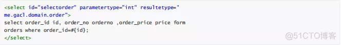
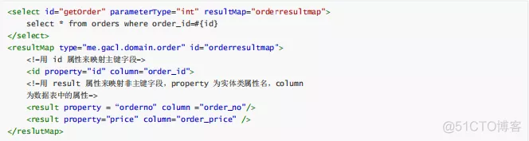

# 什么是mybatis

Mybatis是一个半ORM（对象关系映射）框架，它内部封装了JDBC，开发时只需要关注SQL语句本身，不需要花费精力去处理加载驱动、创建连接、创建statement等繁杂的过程。

# Mybatis的优点

- 基于SQL语句编程，相当灵活
- 动态sql
- 与JDBC相比，减少了50%以上的代码量
- 能够与Spring很好的集成

# Mybatis的缺点

- 拼接复杂SQL语句时，没有代码灵活，拼写比较复杂。不要使用变通的手段来应对这种复杂的语句。
- 对开发人员所写的SQL依赖很强。
- 对SQL语句依赖程度很高；并且属于半自动，数据库移植比较麻烦

# Mybatis使用场景

- 业务较为复杂, 需求变化较多的业务
- 对性能要求较高的业务

# #{} 和${}的区别是什么？

#{}是预编译处理，${}是字符串替换。

# 当实体类中的属性名和表中的字段名不一样，怎么办？

第1种： 通过在查询的sql语句中定义字段名的别名，让字段名的别名和实体类的属性名一致。

第2种： 通过来映射字段名和实体类属性名的一一对应的关系。

# 这个Dao接口的工作原理是什么？Dao接口里的方法， 参数不同时，方法能重载吗

- Dao接口的工作原理是JDK动态代理，Mybatis运行时会使用JDK动态代理为Dao接口生成代理proxy对象，代理对象proxy会拦 截接口方法，转而执行MappedStatement所代表的sql，然后将sql执行结果返回。
- mapper接口可以重载, xml不可以重载

# Mybatis是如何将sql执行结果封装为目标对象并返回的？都有哪些映射形式？

- 使用标签，逐一定义列名和对象属性名之间的映射关系
- 使用sql列的别名功能，将列别名书写为对象属性名，比如T_NAME AS NAME，对象属性名一般是name，小写，但是列名不区分大小写，Mybatis会忽略列名大小 写，智能找到与之对应对象属性名

有了列名与属性名的映射关系后，Mybatis通过反射创建对象，同时使用反射给对象的属性逐一赋值并返回

# 为什么说Mybatis是半自动ORM映射工具？它与全动的区别在哪里？

Hibernate属于全自动ORM映射工具，使用Hibernate查询关联对象或者关联集合对象时，可以根据对象关系模型直接获取，所以它是全自动的。而Mybatis在查询关联对象或关联集合对象时，需要手动编写sql来完成，所以，称之为半自动ORM映射工具。

# Mybatis是否支持延迟加载？如果支持，它的实现原理是什么？

- Mybatis仅支持association关联对象和collection关联集合对象的延迟加载，association指的就是一对一，collection指的就是一对多查询。在Mybatis配置文件中，可以配置是否启用延迟加载lazyLoadingEnabled=true|false。
- 它的原理是，使用CGLIB创建目标对象的代理对象，当调用目标方法时，进入拦截器方法，比如调用a.getB().getName()，拦截器invoke()方法发现a.getB()是null 值，那么就会单独发送事先保存好的查询关联B对象的sql，把B查询上来，然后调用a.setB(b)，于是a的对象b属性就有值了，接着完成a.getB().getName()方法的调用。这就是延迟加载的基本原理。

# Mybatis的一级、二级缓存

- 一级缓存：基于PerpetualCache的HashMap本地缓存，其存储作用域为Session，当Session flush或close之后，该 Session中的所有Cache就将清空，默认打开一级缓存。
- 二级缓存与一级缓存其机制相同，默认也是采用PerpetualCache，HashMap存储，不同在于其存储作用域为Mapper(Namespace)，并且可自定义存储源，如Ehcache。默认不打开二级缓存，要开启二级缓存，使用二级缓存属性类需要实现Serializable序列化接口(可用来保存对象的状态),可在它的映射文件中配置
- 对于缓存数据更新机制，当某一个作用域(一级缓存Session/二级缓存Namespaces)的进行了C/U/D操作后，默认该作用域下所有select中的缓存将被clear

# 什么是MyBatis的接口绑定？有哪些实现方式？

- 在接口的方法上面加上@Select、@Update等注解，里面包含Sql语句来绑定
- 另外一种就是通过xml里面写SQL来绑定,在这种情况下,要指定xml 映射文件里面的namespace必须为接口的全路径名。

# 简述Mybatis的插件运行原理，以及如何编写一个插件？

- Mybatis仅可以编写针对 ParameterHandler、ResultSetHandler、StatementHandler、Executor这4种接口的插件，Mybatis使用JDK的动态代理，为需要拦截的接口生成代理对象以实现接口方法拦截功能，每当执行这4种接口对象的方法时，就会进入拦截方法，具体就是InvocationHandler的invoke()方法，当然，只会拦截那些你指定需要拦截的方法。
- 编写插件：实现Mybatis的Interceptor接口并复写intercept()方法，然后在给插件编写注解，指定要拦截哪一个接口的哪些方法即可，记住，别忘了在配置文件中配置你编写的插件。

# MyBatis的工作原理

#### mybatis重要组件和运行流程图

- Configuration MyBatis所有的配置信息都保存在Configuration对象之中，配置文件中的大部分配置都会存储到该类中
- SqlSession 作为MyBatis工作的主要顶层API，表示和数据库交互时的会话，完成必要数据库增删改查功能
- Executor MyBatis执行器，是MyBatis 调度的核心，负责SQL语句的生成和查询缓存的维护
- StatementHandler 封装了JDBC Statement操作，负责对JDBC statement 的操作，如设置参数等
- ParameterHandler 负责对用户传递的参数转换成JDBC Statement 所对应的数据类型
- ResultSetHandler 负责将JDBC返回的ResultSet结果集对象转换成List类型的集合
- TypeHandler 负责java数据类型和jdbc数据类型(也可以说是数据表列类型)之间的映射和转换
- MappedStatement MappedStatement维护一条<select|update|delete|insert>节点的封装
- SqlSource 负责根据用户传递的parameterObject，动态地生成SQL语句，将信息封装到BoundSql对象中，并返回
- BoundSql 表示动态生成的SQL语句以及相应的参数信息

