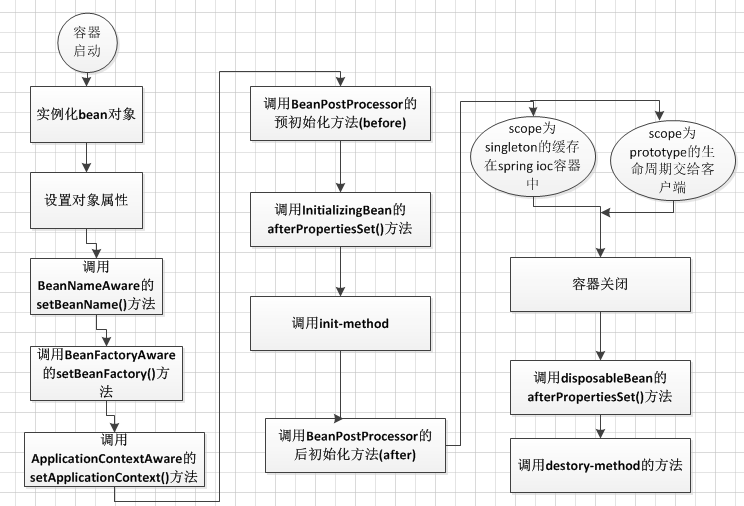

# Spring 是如何管理事务的？

spring的事务声明有两种方式，编程式和声明式。spring主要是通过“声明式事务”的方式对事务进行管理，即在配置文件中进行声明，通过AOP将事务切面切入程序，最大的好处是大大减少了代码量。

# Spring IoC容器配置Bean的方式？

- 基于XML文件进行配置。
- 基于注解进行配置。
- 基于Java程序进行配置（Spring 3+）

# Bean 是如何被管理的？

在Spring框架中，一旦把一个bean纳入到Spring IoC容器之中，这个bean的生命周期就会交由容器进行管理，一般担当管理者角色的是BeanFactory或ApplicationContext。认识一下Bean的生命周期活动，对更好的利用它有很大的帮助。

概括来说主要有四个阶段：实例化，初始化，使用，销毁。

# Spring框架中Bean的生命周期

- 1.首先容器启动后，会对scope为singleton且非懒加载的bean进行实例化，
- 2.按照Bean定义信息配置信息，注入所有的属性，
- 3.如果Bean实现了BeanNameAware接口，会回调该接口的setBeanName()方法，传入该Bean的id，此时该Bean就获得了自己在配置文件中的id，
- 4.如果Bean实现了BeanFactoryAware接口,会回调该接口的setBeanFactory()方法，传入该Bean的BeanFactory，这样该Bean就获得了自己所在的BeanFactory，
- 5.如果Bean实现了ApplicationContextAware接口,会回调该接口的setApplicationContext()方法，传入该Bean的ApplicationContext，这样该Bean就获得了自己所在的ApplicationContext，
- 6.如果有Bean实现了BeanPostProcessor接口，则会回调该接口的postProcessBeforeInitialzation()方法，
- 7.如果Bean实现了InitializingBean接口，则会回调该接口的afterPropertiesSet()方法，
- 8.如果Bean配置了init-method方法，则会执行init-method配置的方法，
- 9.如果有Bean实现了BeanPostProcessor接口，则会回调该接口的postProcessAfterInitialization()方法，
- 10.经过流程9之后，就可以正式使用该Bean了,对于scope为singleton的Bean,Spring的ioc容器中会缓存一份该bean的实例，而对于scope为prototype的Bean,每次被调用都会new一个新的对象，期生命周期就交给调用方管理了，不再是Spring容器进行管理了
- 11.容器关闭后，如果Bean实现了DisposableBean接口，则会回调该接口的destroy()方法，
- 12.如果Bean配置了destroy-method方法，则会执行destroy-method配置的方法，至此，整个Bean的生命周期结束

# Spring中Bean的作用域

#### singleton作用域

在默认情况下,spring的ApplicationContext容器在启动时,自动实例化所有singleton的Bean并缓存于容器中.虽然启动时会花费一些时间,但带来两个好处:首先对Bean提前的实例化操作会及早发现一些潜在的配置问题.其次Bean以缓存的方式保存,当运行时使用到该Bean时就无须再实例化了,加快了运行效率.如果用户不希望在容器启动时提前实例化singleton的Bean,可以通过lazy-init属性进行控制.

#### prototype

在默认情况下,spring容器在启动时不实例化prototype的Bean.此外,spring容器将prototype的Bean交给调用者后,就不再管理它的生命周期.

#### request作用域

每次HTTP请求都会创建一个新的Bean,HTTP请求处理完毕后,销毁这个Bean.该作用域仅适用于webApplicationContext环境.

#### session作用域

同一个HTTP session共享一个Bean,不同HTTP session使用不同的Bean,当HTTP Session结束后,实例才被销毁.该作用域仅适用于webApplicationContext环境

#### globalSession作用域

同一个全局session共享一个Bean,一般用于portlet应用环境,该作用域仅适用于webApplicationContext环境. 

# 什么是IoC和DI？DI是如何实现的？

#### IOC

IOC是Inversion of Control的缩写，“控制反转”之意。 软件系统在没有引入IOC容器之前，对象A依赖于对象B，那么对象A在初始化或者运行到某一点的时候，自己必须主动去创建对象B或者使用已经创建的对象B。无论是创建还是使用对象B，控制权都在自己手上。 软件系统在引入IOC容器之后，这种情形就完全改变了，由于IOC容器的加入，对象A与对象B之间失去了直接联系，所以，当对象A运行到需要对象B的时候，IOC容器会主动创建一个对象B注入到对象A需要的地方。 通过前后的对比，我们不难看出来：对象A获得依赖对象B的过程,由主动行为变为了被动行为，控制权颠倒过来了，这就是“控制反转”这个名称的由来。

#### DI

2004年，Martin Fowler探讨了同一个问题，既然IOC是控制反转，那么到底是“哪些方面的控制被反转了呢？”，经过详细地分析和论证后，他得出了答案：“获得依赖对象的过程被反转了”。控制被反转之后，获得依赖对象的过程由自身管理变为了由IOC容器主动注入。 依赖注入(DI)和控制反转(IOC)是从不同的角度的描述的同一件事情，就是指通过引入IOC容器，利用依赖关系注入的方式，实现对象之间的解耦。

#### 优点

降低类之间耦合，可维护性比较好，非常便于进行单元测试，便于调试程序和诊断故障。 模块之间通过接口交流，互不干扰，便于团队开发。 可复用性好 模块具有热插拔特性，可直接修改配置文件。

#### 缺点

引入了第三方IOC容器，生成对象的步骤变得有些复杂 IOC容器生成对象是通过反射方式，在运行效率上有一定的损耗。 额外的配置工作。

# Spring AOP实现原理

`Spring`的`AOP`实现原理其实很简单，就是通过**动态代理**实现的。如果我们为`Spring`的某个`bean`配置了切面，那么`Spring`在创建这个`bean`的时候，实际上创建的是这个`bean`的一个代理对象，我们后续对`bean`中方法的调用，实际上调用的是代理类重写的代理方法。而`Spring`的`AOP`使用了两种动态代理，分别是**JDK的动态代理**，以及**CGLib的动态代理**。

#### JDK动态代理

Spring默认使用JDK的动态代理实现AOP，类如果实现了接口，Spring就会使用这种方式实现动态代理。

#### CGLib动态代理

`JDK`的动态代理存在限制，那就是被代理的类必须是一个实现了接口的类，代理类需要实现相同的接口，代理接口中声明的方法。若需要代理的类没有实现接口，此时`JDK`的动态代理将没有办法使用，于是`Spring`会使用`CGLib`的动态代理来生成代理对象。`CGLib`直接操作字节码，生成类的子类，重写类的方法完成代理。

`CGLib`实现动态代理的原理是，底层采用了`ASM`字节码生成框架

# Spring AOP 和 AspectJ AOP 有什么区别？

**Spring AOP 属于运行时增强，而 AspectJ 是编译时增强。** Spring AOP 基于代理(Proxying)，而 AspectJ 基于字节码操作(Bytecode Manipulation)。

Spring AOP 已经集成了 AspectJ  ，AspectJ  应该算的上是 Java 生态系统中最完整的 AOP 框架了。AspectJ  相比于 Spring AOP 功能更加强大，但是 Spring AOP 相对来说更简单，

如果我们的切面比较少，那么两者性能差异不大。但是，当切面太多的话，最好选择 AspectJ ，它比Spring AOP 快很多。

# Spring中自动装配的方式有哪些

- no：不进行自动装配，手动设置Bean的依赖关系。
- byName：根据Bean的名字进行自动装配。
- byType：根据Bean的类型进行自动装配。
- constructor：类似于byType，不过是应用于构造器的参数，如果正好有一个Bean与构造器的参数类型相同则可以自动装配，否则会导致错误。
- autodetect：如果有默认的构造器，则通过constructor的方式进行自动装配，否则使用byType的方式进行自动装配。

# 一个 Spring Bean 定义 包含什么？

一个Spring Bean 的定义包含容器必知的所有配置元数据，包括如何创建一个bean，它的生命周期详情及它的依赖。

# Spring 事务中的隔离级别有哪几种?

**TransactionDefinition 接口中定义了五个表示隔离级别的常量：**

- **TransactionDefinition.ISOLATION_DEFAULT:**  使用后端数据库默认的隔离级别，Mysql 默认采用的 REPEATABLE_READ隔离级别 Oracle 默认采用的 READ_COMMITTED隔离级别.
- **TransactionDefinition.ISOLATION_READ_UNCOMMITTED:** 最低的隔离级别，允许读取尚未提交的数据变更，**可能会导致脏读、幻读或不可重复读**
- **TransactionDefinition.ISOLATION_READ_COMMITTED:**   允许读取并发事务已经提交的数据，**可以阻止脏读，但是幻读或不可重复读仍有可能发生**
- **TransactionDefinition.ISOLATION_REPEATABLE_READ:**  对同一字段的多次读取结果都是一致的，除非数据是被本身事务自己所修改，**可以阻止脏读和不可重复读，但幻读仍有可能发生。**
- **TransactionDefinition.ISOLATION_SERIALIZABLE:**   最高的隔离级别，完全服从ACID的隔离级别。所有的事务依次逐个执行，这样事务之间就完全不可能产生干扰，也就是说，**该级别可以防止脏读、不可重复读以及幻读**。但是这将严重影响程序的性能。通常情况下也不会用到该级别。

# Spring 事务中哪几种事务传播行为?

**支持当前事务的情况：**

- **TransactionDefinition.PROPAGATION_REQUIRED：** 如果当前存在事务，则加入该事务；如果当前没有事务，则创建一个新的事务。
- **TransactionDefinition.PROPAGATION_SUPPORTS：** 如果当前存在事务，则加入该事务；如果当前没有事务，则以非事务的方式继续运行。
- **TransactionDefinition.PROPAGATION_MANDATORY：** 如果当前存在事务，则加入该事务；如果当前没有事务，则抛出异常。（mandatory：强制性）

**不支持当前事务的情况：**

- **TransactionDefinition.PROPAGATION_REQUIRES_NEW：** 创建一个新的事务，如果当前存在事务，则把当前事务挂起。
- **TransactionDefinition.PROPAGATION_NOT_SUPPORTED：** 以非事务方式运行，如果当前存在事务，则把当前事务挂起。
- **TransactionDefinition.PROPAGATION_NEVER：** 以非事务方式运行，如果当前存在事务，则抛出异常。

**其他情况：**

- **TransactionDefinition.PROPAGATION_NESTED：** 如果当前存在事务，则创建一个事务作为当前事务的嵌套事务来运行；如果当前没有事务，则该取值等价于TransactionDefinition.PROPAGATION_REQUIRED。

