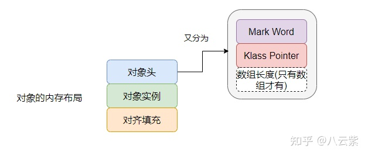
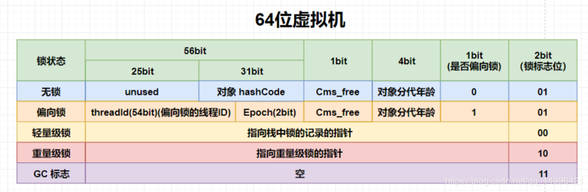
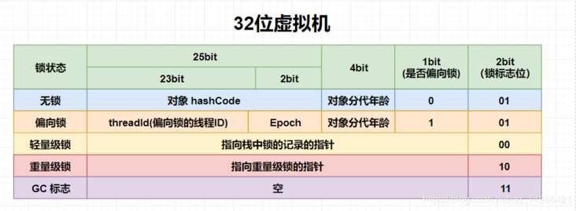
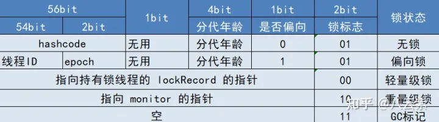
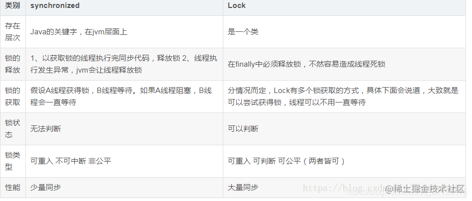

# synchronized实现原理

- 修饰同步代码块 是通过使用monitorenter 和 monitorexit 指令实现的，其中 monitorenter 指令指向同步代码块的开始位置，monitorexit 指令则指向同步代码块的结束位置。 当执行 monitorenter 指令时，**线程试图获取锁也就是获取 monitor监视器对象**(**monitor对象存在于每个Java对象的对象头中) **的持有权。当计数器为0则可以成功获取，获取后将锁计数器设为1也就是加1。 在执行 monitorexit 指令后，将锁计数器设为0

- synchronized 修饰方法的的情况 synchronized 修饰的方法并没有 monitorenter 指令和 monitorexit 指令，取得代之的确实是 ACC_SYNCHRONIZED 标识，该标识指明了该方法是一个同步方法，JVM 通过该 ACC_SYNCHRONIZED 访问标志来辨别一个方法是否声明为同步方法，从而执行相应的同步调用。

# Java对象头

- 以 Hotspot 虚拟机为例，Hopspot 对象头主要包括两部分数据：Mark Word（标记字段） 和 Klass Pointer（类型指针）
- Mark Word：默认存储对象的HashCode，分代年龄和锁标志位信息。
- Klass Point：对象指向它的类元数据的指针，虚拟机通过这个指针来确定这个对象是哪个类的实例。

在64位的虚拟机中：

在32位的虚拟机中：

# ObjectMonitor

- 对象锁的状态是记录在对象头中的**Mark word区域**中
- 在不同的锁状态下，Mark word会存储不同的信息，这也是为了节约内存常用的设计。
- 当锁状态为重量级锁（锁标识位=10）时，Mark word中会记录指向**Monitor对象**的指针，这个Monitor对象也称为**管程**或**监视器锁**。
- 每个对象都存在着一个 Monitor对象与之关联。执行 monitorenter 指令就是线程试图去获取 Monitor 的所有权，抢到了就是成功获取锁了；执行 monitorexit 指令则是释放了Monitor的所有权。
- 在HotSpot虚拟机中，Monitor是基于C++的**ObjectMonitor类**实现的

# 偏向锁

初次执行到synchronized代码块的时候，锁对象变成偏向锁（通过CAS修改对象头里的锁标志位），线程并不会主动释放偏向锁。当第二次到达同步代码块时，线程会判断此时持有锁的线程是否就是自己（持有锁的线程ID也在对象头里），如果是则正常往下执行。由于之前没有释放锁，这里也就不需要重新加锁。如果自始至终使用锁的线程只有一个，很明显偏向锁几乎没有额外开销，性能极高。

# 轻量级锁

轻量级锁是指当锁是偏向锁的时候，却被另外的线程所访问，此时偏向锁就会升级为轻量级锁，其他线程会通过自旋.

## 轻量级锁的获取主要由两种情况：

- 当关闭偏向锁功能时；
- 由于多个线程竞争偏向锁导致偏向锁升级为轻量级锁。

## 轻量级锁自旋

- 在轻量级锁状态下继续锁竞争，没有抢到锁的线程将自旋，即不停地循环判断锁是否能够被成功获取。获取锁的操作，其实就是通过CAS修改对象头里的锁标志位。先比较当前锁标志位是否为“释放”，如果是则将其设置为“锁定”，比较并设置是原子性发生的。这就算抢到锁了，然后线程将当前锁的持有者信息修改为自己。
- 长时间的自旋操作是非常消耗资源的，一个线程持有锁，其他线程就只能在原地空耗CPU，执行不了任何有效的任务，这种现象叫做忙等（busy-waiting）。如果多个线程用一个锁，但是没有发生锁竞争，或者发生了很轻微的锁竞争，那么synchronized就用轻量级锁，允许短时间的忙等现象。这是一种折衷的想法，短时间的忙等，换取线程在用户态和内核态之间切换的开销。

# 重量级锁

- 重量级锁显然，此忙等是有限度的（有个计数器记录自旋次数，默认允许循环10次，可以通过虚拟机参数更改）。如果锁竞争情况严重，某个达到最大自旋次数的线程，会将轻量级锁升级为重量级锁（依然是CAS修改锁标志位，但不修改持有锁的线程ID）。当后续线程尝试获取锁时，发现被占用的锁是重量级锁，则直接将自己挂起（而不是忙等），等待将来被唤醒。
- 重量级锁是指当有一个线程获取锁之后，其余所有等待获取该锁的线程都会处于阻塞状态。
- 简言之，就是所有的控制权都交给了操作系统，由操作系统来负责线程间的调度和线程的状态变更。而这样会出现频繁地对线程运行状态的切换，线程的挂起和唤醒，从而消耗大量的系统资

# synchronized 和Lock锁区别?

