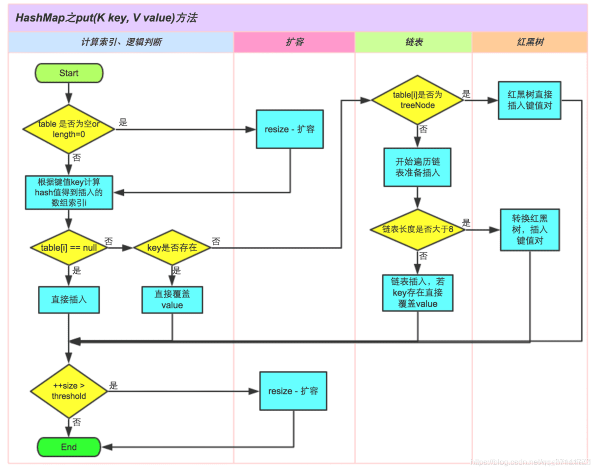

# HashMap底层实现原理

- 数据结构: 数组 + 链表(1.8红黑树)
- Key不可重复
- 无序
- 默认容量 16
- 默认负载因子 0.75, 就是说当size到达12时, 会发生扩容, 扩容为原来的两倍
- 允许一个null key, null value会被覆盖
- 默认链表长度达到8 并且元素数量大于64时, 将链表结构转为红黑树
- 自定义类的对象如果作为key, 必须重写hashcode和equals
- 底层数组的长度总是2的n次方: 2^n, 最长2的30次幂:  2^30


# 影响HashMap性能的重要参数

- 负载因子loadFactor  默认 0.75

- 默认容量 默认 16
- 所能容纳的key-value对极限 threshold = length(数组长度) * Load factor(负载因子, 默认0.75), 超过就扩容

# HashMap之put


# 为什么HashMap的底层数组长度为何总是2的n次方

HashMap根据用户传入的初始化容量，利用无符号右移和按位或运算等方式计算出第一个大于该数的2的幂。

- 使数据分布均匀，减少碰撞

- 当length为2的N次方的时候，h & (length-1) = h % length, 相当于对length取模，而且在速度、效率上比直接取模要快得多

我们来举例当length为奇数、偶数时的情况：


从上面的图表中我们可以看到，当 length 为15时总共发生了8次碰撞，同时发现空间浪费非常大，因为在 1、3、5、7、9、11、13、15 这八处没有存放数据。

这是因为hash值在与14（即 1110）进行&运算时，得到的结果最后一位永远都是0，那么最后一位为1的位置即 0001、0011、0101、0111、1001、1011、1101、1111位置处是不可能存储数据的。这样，空间的减少会导致碰撞几率的进一步增加，从而就会导致查询速度慢。

而当length为16时，length – 1 = 15， 即 1111，那么，在进行低位&运算时，值总是与原来hash值相同，而进行高位运算时，其值等于其低位值。所以，当 length=2^n 时，不同的hash值发生碰撞的概率比较小，这样就会使得数据在table数组中分布较均匀，查询速度也较快。

# HashMap之扩容机制

Jdk1.7

```
void resize(int newCapacity) {   //传入新的容量
    Entry[] oldTable = table;    //引用扩容前的Entry数组
    int oldCapacity = oldTable.length;         
    if (oldCapacity == MAXIMUM_CAPACITY) {  //扩容前的数组大小如果已经达到最大(2^30)了
        threshold = Integer.MAX_VALUE; //修改阈值为int的最大值(2^31-1)，这样以后就不会扩容了
        return;
    }
 
    Entry[] newTable = new Entry[newCapacity];  //初始化一个新的Entry数组
    transfer(newTable);                         //！！将数据转移到新的Entry数组里
    table = newTable;                           //HashMap的table属性引用新的Entry数组
    threshold = (int)(newCapacity * loadFactor);//修改阈值
}
```

```
void transfer(Entry[] newTable) {
    Entry[] src = table;                   //src引用了旧的Entry数组
    int newCapacity = newTable.length;
    for (int j = 0; j < src.length; j++) { //遍历旧的Entry数组
        Entry<K,V> e = src[j];             //取得旧Entry数组的每个元素
        if (e != null) {
            src[j] = null;//释放旧Entry数组的对象引用（for循环后，旧的Entry数组不再引用任何对象）
            do {
                Entry<K,V> next = e.next;
                int i = indexFor(e.hash, newCapacity); //！！重新计算每个元素在数组中的位置
                e.next = newTable[i]; //标记[1]
                newTable[i] = e;      //将元素放在数组上
                e = next;             //访问下一个Entry链上的元素
            } while (e != null);
        }
    }
} 
```

